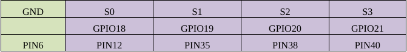
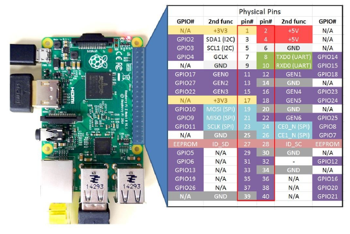

# Daljinsko upravljanje robotskom rukom preko lokalne mreže

Predmeti: Operativni sistemi u realnom vremenu i Osnovi računarskih mreža\
Autori: Simon Radosavljević, Vuk Todorović, Milan Žeželj i Anja Ekres

## Uvod

<div style="text-align: justify"> 
Ovaj projekat predstavlja realizaciju daljinskog kontrolisanja robotizovane ruke preko lokalne mreže. Urađen je kao završni projekat iz predmeta Operativni sistemi u realnom vremenu i predmeta Osnovi računarskih mreža. Ova dokumentacija sadrži opis toka programa, uputstvo za kompajliranje, opis toka rada zasebnih delova sistema i detalje vezane za mrežnu komunikaciju. Sistem se sastoji iz tri dela. Prvi deo predstavlja klijent koji se pokreće na računaru koji se koristi za daljinsko upravljanje rukom. Drugi deo je server koji se pokreće na Raspberry Pi računaru koji je neposredno povezan sa robotskom rukom. Treći deo sistema predstavlja drajver robotske ruke koji komunicira sa serverom na Raspberry Pi-u. Svi delovi su detaljno opisani u nastavku teksta. 

## Tok programa i daljinskog upravljanja

Na početku rada potrebno je kompajlirati i pokrenuti server i propratni softver na Raspberry Pi-u i kompajlirati i pokrenuti klijent na računaru koji je namenjen da se koristi kao daljinski kontroler (u nastavku teksta PC).

Pri startovanju PC klijenta, pokreće se procedura pretraživanja aktivnih servera korsteći UDP broadcast protokol. Zatim se na ekranu ispisuje numerisana lista dostupnih servera zajedno sa svojim korisničkim imenima koja su podešena pri pokretanju servera na Raspberry Pi-u. Nakon toga, korisnik može sa liste da izabere server i pošalje komandu na njega. PC klijent će pokušati da uspostavi TCP konekciju sa serverom i tako obezbedi slanje i primanje komande. Nakon izvršavanje komande nad robotskom rukom, server će klijentu vratiti povratnu informaciju iz drajvera. Potom se prethodno uspostavljena TCP konekcija raskida i korisnik ponovo dobija opciju da bira server na koji će poslati komandu. Program se terminira komandom „exit”.

## Kompajliranje i pokretanje programa

### PC klijent

PC klijent se kompajlira spuštanjem u folder *PC_client* i pokretanjem makefile-a.

``` 
$ make
```

Pokreće se izvršavanjem fajla 'client'.

```
$ ./client
```

### Raspberry Pi server i drajver

#### Log

Tokom rada sa drajverom moguće je posmatrati log u konzoli koji se pokreće sledećom komandom.

```
$ dmesg -w
```

#### Drajver

Radi kompajliranja drajvera potrebno je spustiti se u folder *SW/Driver/servo_ctrl* i pokrenuti makefile.

```
$ make
```

Zatim je potrebno ubaciti moduo u kernel sledećom komandom.

```
$ make start
```

#### Server

Server je integrisan sa aplikacijom koja radi direktno sa drajverom i kompajlira se spuštanjem u folder *SW/Test/test_app_servo_ctrl* i izvršavanjem sledećih komandi.

```
$ ./waf configure
$ ./waf build
```

### Povezivanje hardvera

#### Povezivanje pinova na robotsku ruku.



#### Šema pinova na RPi2



## Detaljniji opis delova sistema

### PC klijent

PC klijent pretražuje lokalnu mrežu za aktivnim serverima slanjem unapred dogovorene poruke preko broadcast adrese koristeći UDP protokol. Zatim počinje da prima poruke. Za svaku primljenu poruku, PC klijent čuva poslato korisničko ime i IPV4 adresu sa koje je poruka primljena. Kada primi poruku, PC klijent šalje potvrdu o prijemu poruke. Nakon izvršenog pretraživanja, PC klijent na konzoli ispisuje listu svih dostupnih servera. Zatim se na PC-u unosi komanda u formatu:
```
[index] [w/r] [servo_idx] [w ? duty : null]
```
Gde ideks predstavlja redni broj servera na koji želite da pošaljete komandu. Drugi argument je karakter koji označava komandu pisanja, odnosno čitanja. Servo_idx predstavlja broj servo motora koji ciljate. Poslednji argument postoji isključivo ukoliko je u pitanju naredba pisanja i predstavlja koeficijent pomeranja ugla motora. Na osnovu unosa PC klijent šalje TCP zahtev na željeni server. Nakon slanja, klijent ispisuje povratne informacije drajvera na ekran. Potom se raskida TCP konekcija i čeka se unos nove komande nakon koje će se ponovo inicirati TCP konekcija.

### Raspberry Pi server

Raspberry Pi server čeka UDP signal (poslat preko broadcast-a) i šalje svoje podatke nazad klijentu preko UDP-a. Zatim čeka potvrdu o prijemu ili šalje svoje podatke ukoliko ponovo dobije signal za slanje. Nakon potvrde o slanju očekuje TCP koneckiju. Po uspostavljanju TCP konekcije, očekuje komandu koju zatim prosledjuje drajveru. Server šalje povratnu informaciju sa drajvera klijentu i TCP konekcija se raskida. Nakon toga ponovo očekuje novu TCP konekciju.

### Drajver (Raspberry Pi)

Implementacija drajvera se nalazi u *SW/Driver/main.c* fajlu. Kada se drajver kompajlija on napravi fajl drajvera u */dev/servo_ctrl* i na akcije pisanja i čitanja u taj fajl on izvrsava komande nad servo uređajima. Aplikacija radi sa drajverom tako što od servera prima string u formatu:

```
w servo_idx duty //Za pisanje
r servo_idx //Za čitanje
```

- w - oznaka da se radi o akciji pisanja u fajl drajvera odnosno rotiranje servo motora.
- r - oznaka da se radi o akciji čitanja stanja servo uredjaja (komanda vraća ugao za koji je motor rotiran).
- servo_idx - oznacava id ciljanog servo motora i može imati jednu vrednost iz niza [0, 1, 2, 3].
- duty - servo motorom se upravlja preko PWM pina i vrednost koja govori o rotaciji servo motora je faktor ispune PWM signala odnosno duty u ovom kodu. Duty može imati vrednost od 0 do 1000 sto se mapira na određene uglove.

## Detalji mrežne komunikacije

### Portovi

UDP Broadcast: 25567 \
UDP: 25565 \
TCP: 25566

### UDP broadcast

Klijent šalje poruku “ping” preko broadcast-a na portu *25567*.\
Kada server dobije “ping” poruku, odgovori sa detaljima “$username” preko porta *25565*. \
Klijent prima ime servera i šalje “Received details”.\
Server čeka “Received details” poruku od PC klijenta. Nakon što primi potvrdu, otvara port za TCP konekciju.

### TCP connection

Korisnik bira server iz liste dostupnih servera i klijent inicira TCP konekciju na izabrani server. \
Klijent šalje read/write komandu u formatu “[w/r] [servo_idx] [w ? duty : null]”. \
Server prima poruku i šalje nazad povratnu informaciju od drajvera, ili “Error: ErrorMsg”.

Za dodatne informacije o drajveru pogledati: \
https://www.rt-rk.uns.ac.rs/sites/default/files/materijali/lab/vezba05.zip